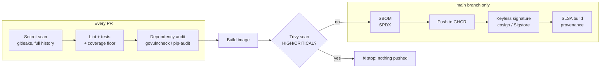

# devsecops-pipeline-templates


Reusable GitHub Actions workflows that give any repository a secure CI/CD pipeline in a few lines. Every template is tested on each change by running it against the sample apps in `examples/`.



## Templates

| Workflow | What it does |
|---|---|
| `go.yml` | gofmt, `go vet`, race-detector tests, **coverage floor**, `govulncheck` |
| `python.yml` | ruff with Bandit security rules, pytest with a **coverage floor**, `pip-audit` |
| `secrets-scan.yml` | gitleaks over the **entire git history**, so a secret committed and later deleted is still caught |
| `container.yml` | Build → Trivy scan (results to the Security tab) → **gate on HIGH/CRITICAL** → SPDX SBOM → push → **keyless cosign signature** → **SLSA provenance attestation** |
| `terraform.yml` | fmt, validate, tflint, Checkov (results to the Security tab) |

## Use them

In any repository, create `.github/workflows/ci.yml`:

```yaml
name: ci
on:
  push:
    branches: [main]
  pull_request:

permissions:
  contents: read

jobs:
  secrets:
    uses: speakwithuche-create/devsecops-pipeline-templates/.github/workflows/secrets-scan.yml@v1

  test:
    uses: speakwithuche-create/devsecops-pipeline-templates/.github/workflows/go.yml@v1
    with:
      coverage-threshold: 80

  image:
    needs: [secrets, test]
    permissions:
      contents: read
      packages: write
      id-token: write
      attestations: write
      security-events: write
    uses: speakwithuche-create/devsecops-pipeline-templates/.github/workflows/container.yml@v1
    with:
      image-name: ${{ github.repository }}
      push: ${{ github.ref == 'refs/heads/main' }}
```

Callers pin a tag (`@v1`), so template changes reach them only when they choose to upgrade.

## Verify a published image

Anyone can confirm an image came from this pipeline, unmodified:

```bash
# Signature: made by this repo's workflow, recorded in the public Sigstore transparency log
cosign verify ghcr.io/OWNER/IMAGE@sha256:<digest> \
  --certificate-identity-regexp "https://github.com/OWNER/.+" \
  --certificate-oidc-issuer https://token.actions.githubusercontent.com

# Provenance: which commit and workflow built it
gh attestation verify oci://ghcr.io/OWNER/IMAGE@sha256:<digest> --owner OWNER
```

## Security design

- **Least-privilege tokens.** Every workflow defaults to `contents: read`. Write scopes (`packages`, `id-token`, `attestations`) are granted only to the job that needs them.
- **No long-lived secrets.** Signing is keyless: GitHub's OIDC token proves the workflow's identity to Sigstore. GHCR uses the built-in `GITHUB_TOKEN`.
- **Scan before push.** The image is built and scanned locally first. A failed scan means nothing ever reaches the registry.
- **No script injection.** Inputs reach shell steps through `env:`, never interpolated straight into `run:` blocks. `actionlint` + `shellcheck` enforce this in CI.
- **Pull requests never publish.** Push, sign and attest run only on `main`.
- **Actions stay patched.** Dependabot opens weekly updates for every action and example dependency. For stricter environments, pin third-party actions to full commit SHAs, e.g. with [`pinact`](https://github.com/suzuki-shunsuke/pinact).

## Self-test

`.github/workflows/self-test.yml` runs on every change. It runs `actionlint` + `shellcheck` over all workflows, then calls each template against `examples/go-app` (100% coverage) and `examples/python-app` (100% coverage). A template change that breaks a pipeline fails here first.
